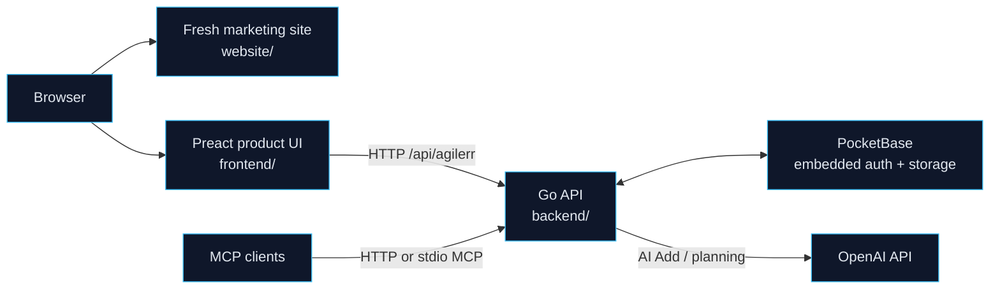

# Agilerr

[](https://github.com/sponsors/rmalcomber)
[](https://buymeacoffee.com/rmalcomber)
[](https://agilerr.app)

Agilerr is a local-first Agile Scrum board with:

- a Go backend
- embedded PocketBase for auth and storage
- a Preact product UI
- a Fresh marketing site for `agilerr.app`
- optional OpenAI-powered planning flows
- REST and MCP surfaces for automation

## Architecture



## Repository Layout

- `backend/`: Go API, PocketBase bootstrap, permissions, AI flows, MCP, embedded frontend serving
- `frontend/`: Preact product app
- `website/`: Fresh 2 marketing site and download surface
- `scripts/`: release scripts
- `tools/faq-capture/`: screenshot tooling for docs and marketing assets

## Features

- strict hierarchy: `Project -> Epic -> Feature -> User Story -> Task`
- dedicated bug workflow with triage
- project dashboard, backlog, kanban, deleted items, API docs, MCP docs, and user admin
- markdown descriptions and comments
- tags, mentions, assignments, permissions, and project membership
- AI Add planning sessions with review before creation
- versioned binary builds and database schema tracking

## Local Development

1. Copy `.env.example` to `.env`
2. Set at least `ADMIN_PASSWORD`
3. Run the backend:

```bash
cd backend
go run .
```

4. Run the product frontend in another terminal:

```bash
cd frontend
npm install
npm run dev
```

5. Run the marketing site if needed:

```bash
cd website
deno task dev
```

Important local URLs:

- product frontend: `http://localhost:5173`
- marketing site: `http://localhost:8000` or the port Vite prints for the Fresh app
- backend: uses `HTTP_ADDR` if set, otherwise generates a local port and prints it on startup

In dev mode the product frontend is not embedded. Vite proxies API calls to the backend.

## Release Build

```bash
./scripts/build-release.sh
```

This produces:

- `output/agilerr` for quick local testing
- versioned archives in `output/<version>/`
- matching files in `website/static/downloads/`

The default cross-compiled matrix is:

- `linux/amd64`
- `linux/arm64`
- `darwin/amd64`
- `darwin/arm64`
- `windows/amd64`

## Docker

Local compose:

```bash
cp .env.example .env
docker compose up --build
```

Root image build:

```bash
docker build -t rmalcomber/agilerr:tagname .
docker push rmalcomber/agilerr:tagname
```

## Important Environment Variables

- `ADMIN_EMAIL`
- `ADMIN_PASSWORD`
- `AGILERR_API_KEY`
- `OPENAI_API_KEY`
- `OPENAI_BASE_URL`
- `OPENAI_MODEL`
- `HTTP_ADDR`
- `PB_DATA_DIR`
- `ALLOWED_ORIGINS`

If `HTTP_ADDR` is unset, Agilerr generates a random local port.

If `AGILERR_API_KEY` is unset, Agilerr generates a random API key for that run and prints it on startup.

## Contributing

See [CONTRIBUTING.md](CONTRIBUTING.md).

The intended promotion flow is:

- feature branches -> `dev`
- selected release candidates -> `stage`
- tagged releases -> `main`

## Funding

- GitHub Sponsors: https://github.com/sponsors/rmalcomber
- Buy Me a Coffee: https://buymeacoffee.com/rmalcomber
